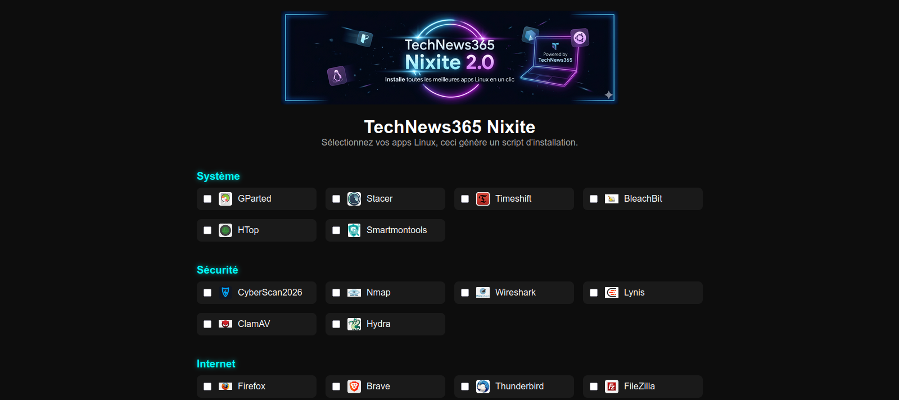
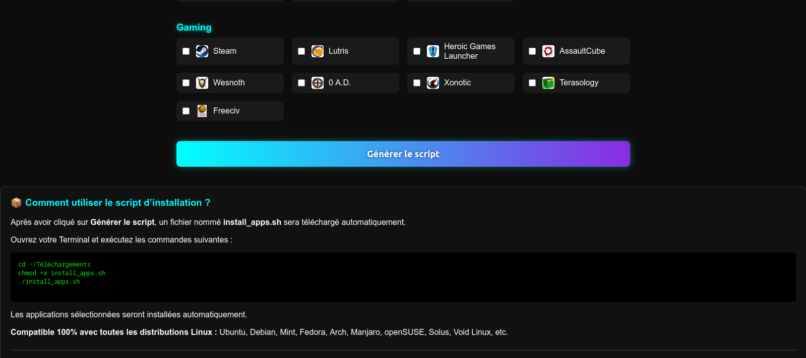

  

  
  
  
  
  

  
  
  
  
  
  
  

  
  
  

  <a href="https://technews365.fr/nixite2/">
    🔗 Page officielle TechNews365 Nixite 2.0
  </a>

🚀 Présentation

Nixite 2.0 est un installateur d’applications Linux universel, conçu pour les utilisateurs qui veulent installer rapidement les meilleures applications…
👉 sans utiliser le terminal.

Sélectionnez vos apps → cliquez → un script d’installation est généré automatiquement.

Compatible Ubuntu, Debian, Mint, Arch, Manjaro, Fedora, openSUSE, Solus, Void Linux, etc.

✨ Fonctionnalités

    Interface moderne, simple et intuitive

    Icônes propres + catégories organisées

    Détection automatique de la distribution

    Installation multi‑systèmes :

        APT (Ubuntu/Debian/Mint)

        DNF (Fedora)

        PACMAN (Arch/Manjaro)

        Zypper (openSUSE)

    Génération automatique d’un script .sh

    Installation en 3 commandes

    100% compatible Linux

📦 Liste des catégories

    Système

    Sécurité

    Internet

    Développement

    Multimédia

    Bureautique

    Gaming

🧩 Comment utiliser Nixite 2.0 ?

    Ouvrez la page :
    👉 https://technews365.fr/nixite2 (disponible cette semaine)

    Sélectionnez vos applications

    Cliquez sur Générer le script

    Téléchargez install_apps.sh

    Exécutez :

chmod +x install_apps.sh
./install_apps.sh

<h2 align="center">📸 Captures d’écran</h2>

  
  

